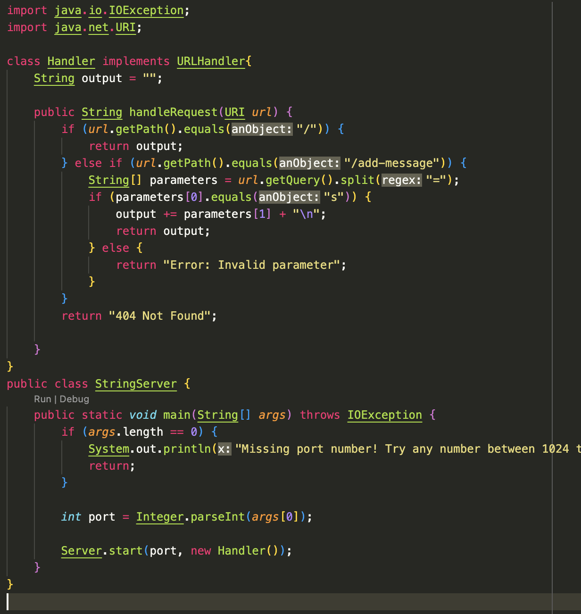
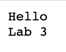

# Lab 2 - Servers and Bugs
### Samvrit Srinath: A17436822

## **Part 1**: String Server

The affiliated code for the ***StringServer*** Class is attached here: 

What this class does is that it has a class called `Handler` that handles requests to this server. As well as a main method that initializes the server in the case for a valid port number. 

So for giving the terminal commands :

	javac StringServer.java Server.java
	java StringServer 3000

This starts a server locally on port 3000 and compiles `StringServer.java` and `Server.java`.

After opening the server and a new tab, we can input this into the web-bar:

`http://localhost:3000/add-message?s=Hello`

The domain is `localhost:3000` and then the path is `add-message`. After this is the query is: `s=Hello`. This is the message that is being added to the server. So the method: `Handle Request`: with arguments `URI url` or a valid Url passed in: is called and the message checks for the path, then a valid query is checked for. A field pertaining to this class is `output` which is the combined message of all the added messages and this is updated every time `add-message` is the path used. Then, the element is added to output with a new line and the message is returned. 

As such the new output would be `Hello`: shown by this screenshot:

### Second Screenshot

Using this request:

`http://localhost:3000/add-message?s=Lab%203`

What this will do is call the method `Handle Request` with the argument `URI url` or a valid Url passed in.
This request will modify the `output` field in the class `StringServer` and add the message `Lab 3` to the output. The reason why `%20` is used because the space character is invalid in a URL: which could cause compiler errors. So for a space to be inserted into a request: the `%20` is used.

As the method checks for the path, subsequently a valid query is checked for, and then is split using the delimiter `=`: this checks for a valid query type as well as the input, and so `parameters[1]` represents the message to be added to the output. The output field of `Handler` is modified as valid requests are made and the strings for the `Handler` class are updated after every query with path `add-message`.

This call also changes the parameter passed in: `URI url` now is represented by the new request: 
`http://localhost:3000/add-message?s=Lab%203`. This is shown in the screenshot below:

One important thing to note is that prior to all of this: the `main` method in `StringServer` is called to initialize the server to a valid port and start the server. From there, as the Server is being looped through(called indefinetely until `Ctrl + C` or exit), the `Handle Request` method is called for every request made. 

## **Part 2**: Bugs

A particular Bug I noticed from from the code in Lab 3 was a method called: `reverseInPlace` which was supposed to reverse the elements in an array without creating a temporary array. The code for this method is below: 

As you can see based on the method, an int[] array is passed in, and the method loops through the entire array and swaps the elements at the beginning and the end of the array. 

1. A Failure Inducing Input would be: 
###
	@Test
	public void testReverseInPlace(){
		int[] input = {1,2,3,4}; //Input array would be 1,2,3,4
		int[] expected = {4,3,2,1}; //Expected array would be 4,3,2,1
		reverseInPlace(input);
		assertEquals(expected, input);
	}

This would fail as the method would compare the two arrays and the reverseInPlace method would incorrectly try to reverse the array, thus not matching the expected output.

2. An Input that does not produce a failure: 
###
	@Test
	public void testReverseInPlace2(){
		int[] input = {4,3,3,4}; //input array would be 4,3,3,4
		int[] expected = {4,3,3,4};
		reverseInPlace(input);
		assertEquals(expected, input);
	}

3. The `JUNIT` Output for the above tests(plus a bit more):

Or if you want the terminal Output:

The clear symptom is that: **The method does not stop reversing the array**. When the middle of the array is reached, the method should ideally stop and not continue to reverse the array. 

However, the current method configuration causes the reversing to continue to occur, but what eventually happens is that, since the first $1/2$ of the array is already reversed, these values are simply copied over to the second half of the array.

4. The Bug:

The Clear Bug is that the method has a `for` loop which loops through from `i = 0` to `i < arr.length`. This causes the method to continue to reverse the array, even after the array has been reversed. Another bug is that the initial values are not stored for the first $1/2$ of the array, and so the values are simply copied over from the second half to the first half. 

So there are two steps:

1. The `for` loop should be changed to `i < arr.length/2` so that the method stops reversing the array after the first $1/2$ of the array is reversed.
2. The initial values should be stored in a temporary value(or an array) so that once the value at the first half of the array is swapped: the value at the second half of the array is swapped with the initial value. 

So Before: we had

	static void reverseInPlace(int[] arr) {
    	for(int i = 0; i < arr.length; i += 1) {
      		arr[i] = arr[arr.length - i - 1];
    	}
  	}

However: to fix the bugs:

	for(int i = 0; i < arr.length/2; i++) {
		int temp = arr[i];
		arr[i] = arr[arr.length - i - 1];
		arr[arr.length - i - 1] = temp;
    }

Where we assign a temporary value to store the initial value, swap the value of the array at index `i` and then swap the value of the array at index 
`arr.length - i - 1` with the initial value.

## **Part 3**: Something new

Something new I learned was regarding how to build and configure your own server. Before Week 2, the concepts of queries, handling requests, Ports and instantiazing a server were not known to me. However, after learning about these concepts, I was able to build a server and handle requests. Things like splitting up a query, using `regex` and returning valid output were all new to me. Also, knowing which URL to use to access the server from the `ieng6` virtual machine was also new to me.

(format: `http://ieng6-20x.ucsd.edu:PortNum`).

