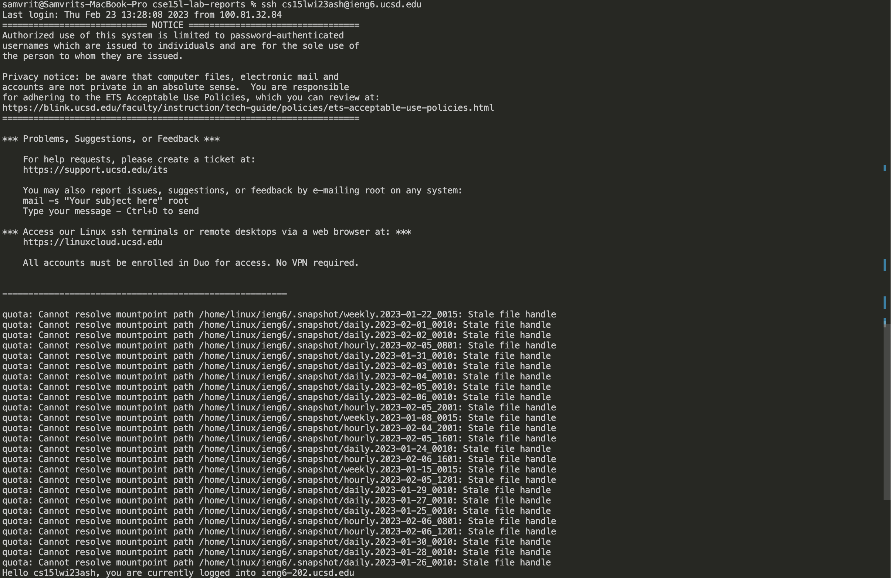
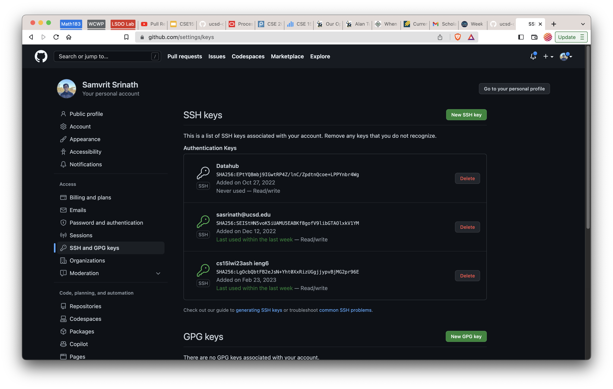
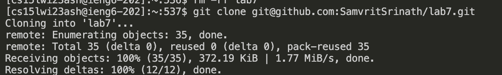
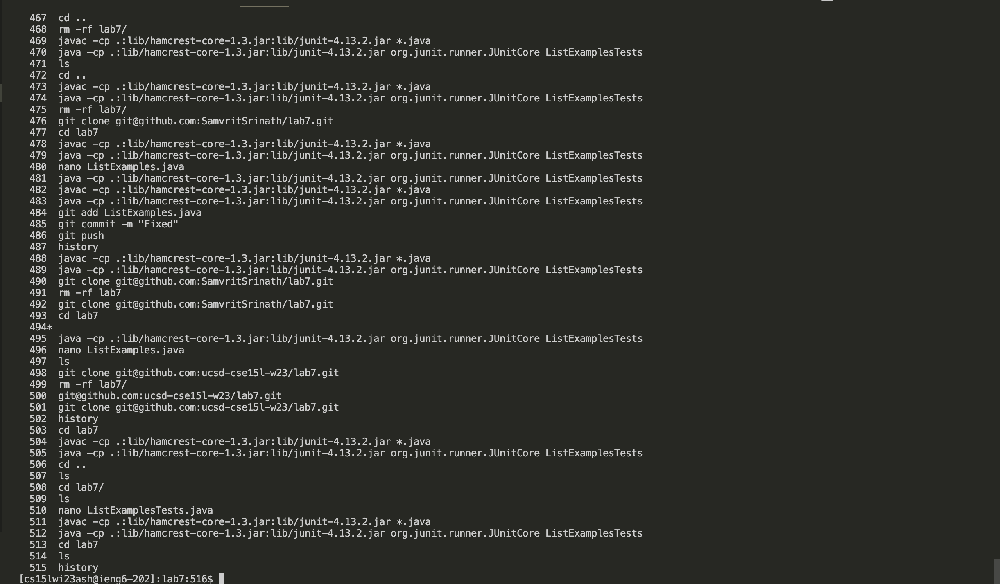
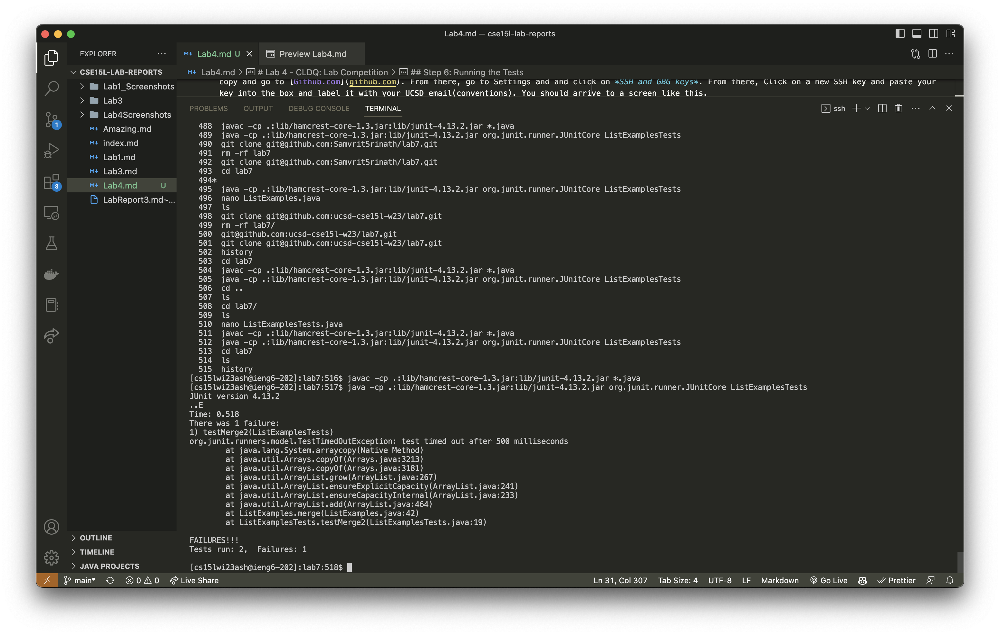
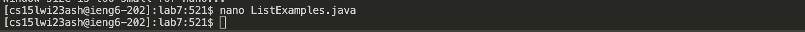
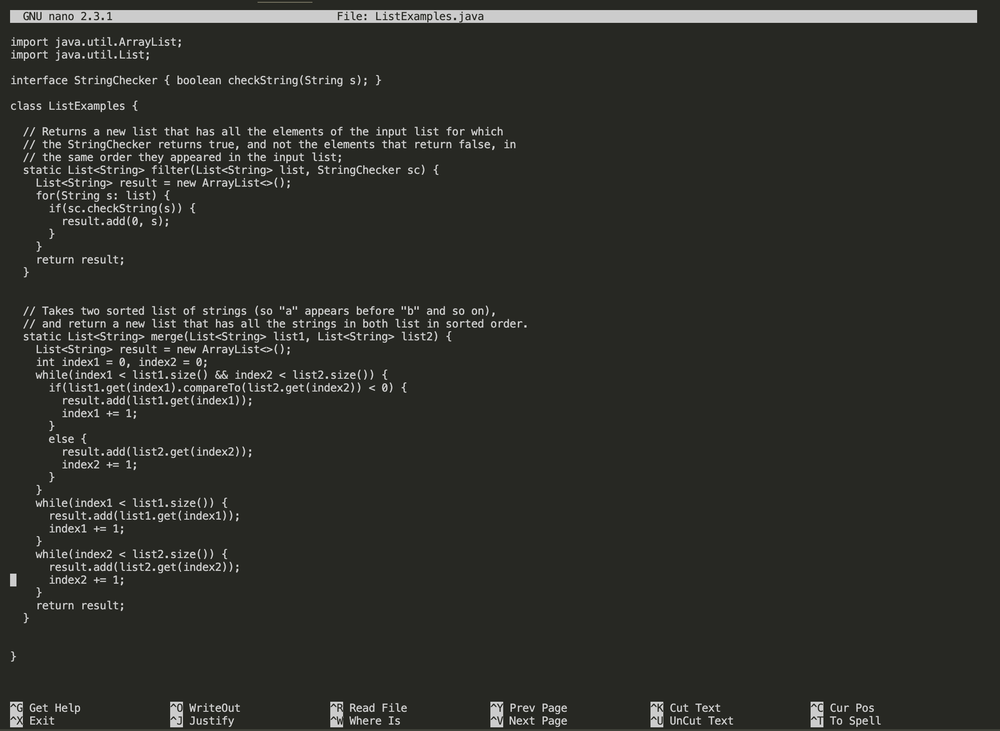
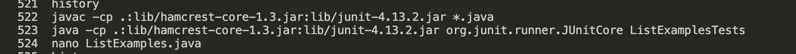
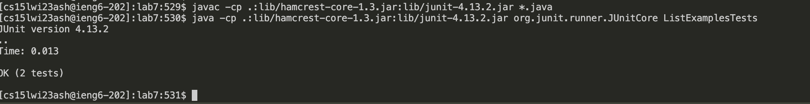
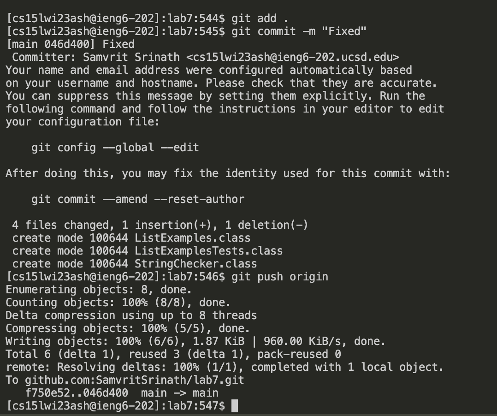

# Lab 4 - CLDQ: Lab Competition
## Samvrit Srinath A17436822
This lab will go over the specific key inputs needed to achieve the tasks outlined in the lab competition, to run JUNIT tests, run a bash script and successfully integrate editing code in the command line, and updating it in a repository on an external server. Since this Lab Report only highlights steps 4-9: this lab report will skip over steps to fork the repository, setting up SSH keys, and starting the timer. Let's get started!

## Step 4: Login to SSH
In previous lab tasks, we've set up SSH keys to enable us to login to `ieng6` without needing to enter a password. This can be achieved using `ssh-keygen`, getting a random art image, and using `scp <path to key> ieng6.ucsd.edu:~/.ssh/authorized_keys`. This will load our key onto the `ieng6` remote server and allow the server to recognize our machine as an authorized user. 

Now we can login to `ieng6` using the key inputs: `ssh cs15lwi23___@ieng6.ucsd.edu <enter>`(Mine was ash) and now we don't need a password so we can directly login to the server. See the screenshot and note that there was no password prompt. 

## Step 5: Clone and fork repositor
In this step, we need to clone the repository from the remote server onto our local machine. This can be done using `git clone <path to repo>`. This will create a local copy of the repository on our machine. However, one step that I implemented was to have SSH keys for Github loaded in the `ieng6` server. This will allow us to clone repositories without needing a password. 

### Setting up SSH Keys for Github
- Ensuring that you're logged into ieng6, run the command `ssh-keygen` to generate a new SSH key. Then use `cat <path to key>` and copy using `Ctrl + C` to copy and go to [Github.com](github.com). From there, go to Settings and and click on *SSH and GBG keys*. From there, Click on a new SSH key and paste your key into the box and label it with your UCSD email(conventions). You should arrive to a screen like this.

Now to legitimize the key, go back to ieng6 and run the command with these key inputs `ssh-keyscan -t rsa github.com >> ~./ssh/known_hosts`. This will add the key to the known hosts file.
And finally test your connection using the command `ssh -T git@github.com`. If you see a message saying that you were successfully authenticated, you're good to go!

### Cloning the repository
Keys Pressed: `git clone <Ctrl + V> <enter>`
First we must fork the repository. Using this link: [Repository](https://github.com/ucsd-cse15l-w23/lab7), fork the repository and then clone using this command. `git clone <Ctrl + V> <enter>`. I used `CTRL + V` to paste the link to the repository as Github.com allows you to copy the SSH command `git@github.com:SamvritSrinath/lab7.git` from the browser itself, I did this prior to ssh-ing. This will clone the repository onto our local machine.

## Step 6: Running the Tests
Keys Pressed: `cd lab7 <enter> <up><up><up><up><up><enter> <up><up><up><up><up><enter>`

First I use the command `cd lab7 <enter>` to navigate to the directory. Then my inputs are: `<up><up><up><up><up><enter> <up><up><up><up><up><enter>`
The reason why is that I have so many up inputs is to access the JUNIT compile and run commands which are respectively: `javac -cp .:junit-4.12.jar:hamcrest-core-1.3.jar *.java` and `java -cp .:junit-4.12.jar:hamcrest-core-1.3.jar org.junit.runner.JUnitCore ListExampleTests`. I used the up arrows to access these two commands run them by using enter, these were the 5th elements in my history. this way I can avoid copy pasting the commands which are complicated to run. 

## Step 7: Fixing the File to fix the failed Tests

Now that we know a test is failing my inputs are `nano L<tab> .java <Use Mouse> <enter> <right><right><right><right><right><right><right><right><right><right><right><right> <backspace> 2 <Ctrl + X> y <enter>`
This may seem like a lot of commands but let's do this step by step.
I use the `nano` command knowing that I need to edit a file. I type `L + <tab>` so that bash can autocomplete the rest of the file which is `ListExamples` but there are other files with `ListExamples...` so I specify the extension .java and click enter to enter the editor. Now, I scroll using the mouse to line that contains `index1 +=1 ` two lines above the return statement. Nano allows the user to scroll actively to a specific line. 
Then, I use the arrow keys 12 times to navigate to the 12th column of that line and use backspace twice. This deletes the erroneous `1` in `index1` and I then replace it with `index2`. I then use `Ctrl + X` to exit the editor, and then `y` to save the changes and `enter` to confirm the file name.

## Step 8: Running the Tests again
Keys Pressed: `<up><up><up> <enter> <up><up><up><enter>`
Now that we've fixed the file, we need to run the tests again. I use the up arrow to access the commands to compile and run the JUNIT tests. I then use enter to run the commands. This is because the only command that ran after I compiled and ran the Junit Tests was the `nano` command. This means that the javac is 3 lines above the current line and the java command is 2 lines above the current line. Using the first 3 arrows, I can access the javac command and run it. Then using the next 3 arrows(as the `javac` was run), I can access the java command and run it.

## Step 9: Pushing the changes to the remote repository
At this point, the files have been fixed and everything is working, so now I wanted to commit these changes to my repository. 
Keys Pressed: `git add . <enter> git commit -m "Fixed" <enter> git push origin`
I used the command `git add .` to add all the files to the staging area. Then I used `git commit -m "Fixed"` using the `-m` option also allows me to avoid entering Vim to edit the commit message and I'm able to commit the changes to the local repository. Then I used `git push origin` to push the changes to the remote repository.

And that's a Key by Key walkthrough of the lab!