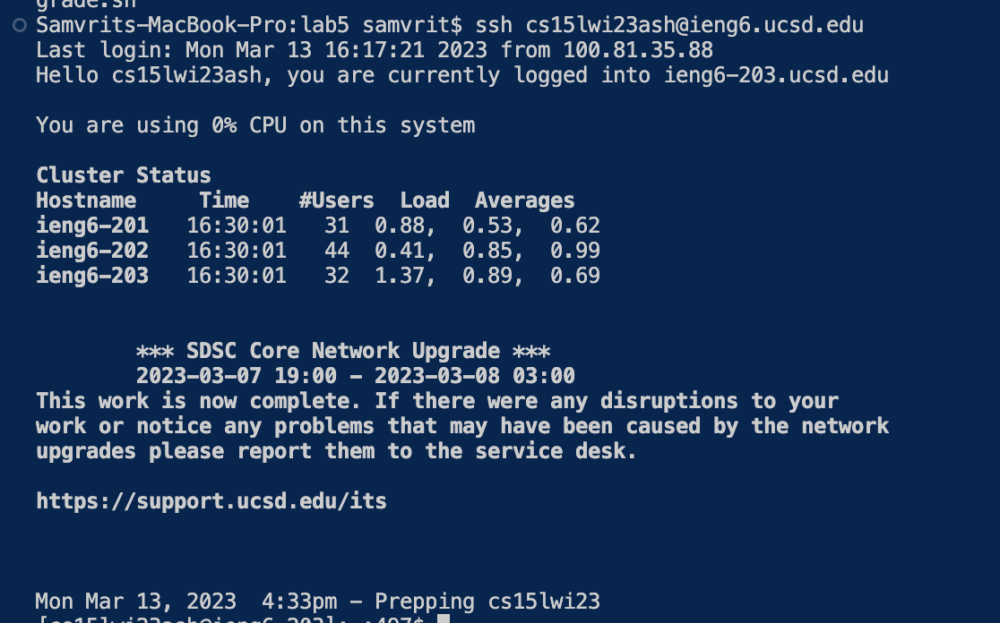
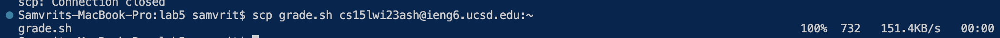
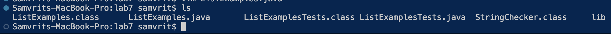
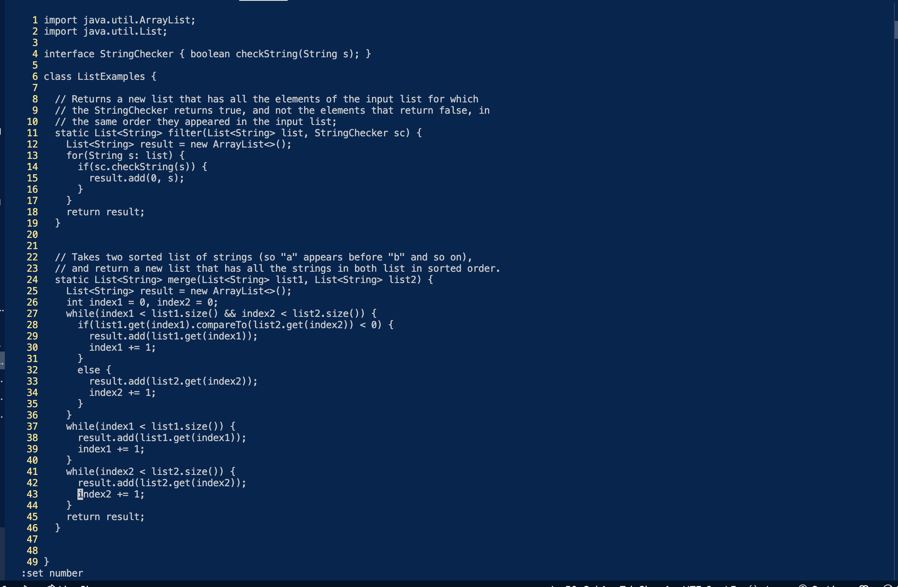
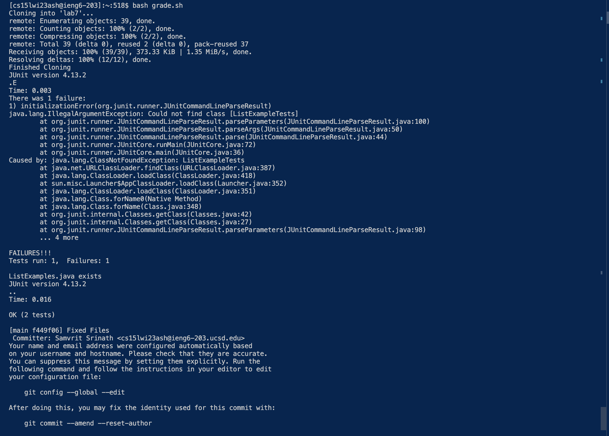
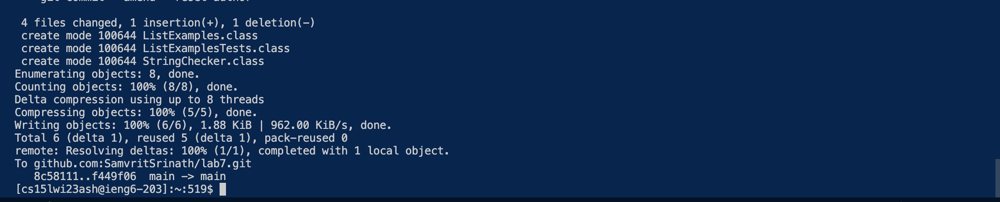

# Lab Report 5 - Lab Report 4 but Bash Scripted
## Samvrit Srinath A17436822

## Building a Bash Script for Lab 4
This lab report will be considered with how we can automate processes using bash scripting. We will be using the same specifications as Lab 4, but seeing how we can automate the process using bash scripting(e.g. using scripts to edit files and replace characters or running servers). At the end of this lab report, we will have a full bash script that has the same functionality as doing all the steps from 4-9 from Lab 4. 

For reference: Step 4 - 9 were: 
1. log into ieng6
2. Clone your fork of the repository from your Github account
3. Run the tests, demonstrating that they fail
4. Edit the code file to fix the failing test
5. Run the tests, demonstrating that they now succeed
6. Commit and push the resulting change to your Github account (you can pick any commit message!)

## Prep Work

### SSHing into ieng6

The first step is to SSH into ieng6. Each person will have their own credentials, for me it is: 
`cs15lwi23ash@ieng6.ucsd.edu`. Also, we can also enable SSH keys to make it easier to log in. But in general, the format for SSHing into `ieng6` is 
`ssh cs15lwi23___@ieng6.ucsd.edu`. 


#### SSH Keys

This can be achieved using `ssh-keygen`, getting a random art image, and using `scp <path to key> ieng6.ucsd.edu:~/.ssh/authorized_keys`. This will load our key onto the `ieng6` remote server and allow the server to recognize our machine as an authorized user. This should be done prior to creating the bash script, as the bash script is local to our machine, and we would be able to run a script that would SSH into `ieng6` and run the rest of the script.	

**However this should all be done prior to running the bash script.** This is because the bash script is local to the environment its in, and after SSHing into `ieng6` the bash script would not be able to continue executing until the server is closed. 


### Cloning the Repo

Once we're ssh'd into `ieng6`, we can clone the repo. This can be done using `git clone <repo url>`. This will clone the repo into the current directory.
In this case we need to clone the repo from our forked repo, so we can use `git clone git@github.com:SamvritSrinath/lab7.git` to clone the repo. 
**Note**: I had already forked the repo from the original repo, and this was done prior to running the lab script. 

**Note 2**: There are two ways to achieve this, using the HTTP Clone method or the SSH Clone Method. The SSH Clone method is more secure, as it uses SSH keys to authenticate the user. 

We can set up Github Keys by: 
Ensuring that you're logged into ieng6, run the command `ssh-keygen` to generate a new SSH key. Then use `cat <path to key>` and copy using `Ctrl + C` to copy and go to [Github.com](github.com). From there, go to Settings and and click on *SSH and GBG keys*. From there, Click on a new SSH key and paste your key into the box and label it with your UCSD email(conventions). 
Now to legitimize the user, `ssh-keyscan -t rsa github.com >> ~./ssh/known_hosts`. This will add the key to the known hosts file.
And finally test your connection using the command `ssh -T git@github.com`. This is not necessary, but perhaps another approach to make our bash script more useful, but this would be done prior to running the bash script. This would be necessary for GitHub to not ask us for a passphrase prior to committing and pushing changes to the forked repository and allowing our bash script to run completely unattended.

Also, we would need to copy over our bash script to ieng6, and this can be done using `scp <path to bash script> cs15lwi23___@ieng.ucsd.edu:~`.



## Running and Debugging
### Running the Tests

We need to run the tests to see if they fail. This can be done using the conventional JUNIT Commands. We first `cd` into the cloned github folder `lab7` and then run these commands: `javac -cp .:junit-4.12.jar:hamcrest-core-1.3.jar *.java` and `java -cp .:junit-4.12.jar:hamcrest-core-1.3.jar org.junit.runner.JUnitCore ListExampleTests 2> &1`. The reason we are redirecting the error output to standard output is because we want to check if the tests failed. If the tests failed, we want to edit the code to fix the failing test. We use ListExampleTests as the file as if we `ls` or see the folder contents once we are in `lab7` we can see that there is a file called `ListExampleTests.java`, and that contains our tests. 



### Editing the code

Editing the code from requires the use of a new command: `sed`. I used `man sed` to get the details of how to use `man sed`. In essence, what we want to do is find where the test fails, and replace the code with the correct code. We can do this using the template command`sed -i 's/old/new/' <file name>`. This will replace all instances of `old` with `new` in the file `<file name>`. However, sed will erase the original file and output to standard output: so what we need to do is create a dummy file, in this case I used `ListExamples2.java` and redirected the output of `sed` to that file and moved the contents of the the dummy file to the original `ListExamples.java` file. Although not as stable, this achieved the necessary results to compile the tests and have the correct output.  In this case, our error is on line 43 if we used `vim ListExamples.java` and at the prompt type `:set number` to see line numbers..  We can use `sed -i 43s/index1/index2/g ListExamples.java > ListExamples2.java && mv ListExamples2.java ListExamples.java` to replace the code.



### Running the Tests Again

We can run the tests again using the same commands as before. If the tests pass, we can commit and push the changes to our forked repo. For this we use 
`javac -cp .:junit-4.12.jar:hamcrest-core-1.3.jar *.java` and `java -cp .:junit-4.12.jar:hamcrest-core-1.3.jar org.junit.runner.JUnitCore ListExampleTests` since we fixed the errors. If more errors were to occur, we could revise the code to output standard error to standard out and edit the code accordingly. 


### Committing and Pushing the Changes

Using `git add .` and `git commit -m "message"` and `git push` we can push the changes to our forked repo. In this scenario, we can use `git add .` to add all the files we've modified, which includes the class files and the revised `ListExamples` or we could use `git add ListExamples.java` to add only the file we've modified.

We can then commit our changes using `git commit -m "Fixed Files"` and push our changes using `git push`. And now we've modified and shown that the tests run successfully from only a bash script. 

In its entirety the bash script looks like this:

```
# SSH prior to running bash script
# Debugging statement for repo already existing
rm -rf lab 7

git clone git@github.com:SamvritSrinath/lab7.git

cd lab7

javac -cp .:lib/hamcrest-core-1.3.jar:lib/junit-4.13.2.jar *.java

java -cp .:lib/hamcrest-core-1.3.jar:lib/junit-4.13.2.jar org.junit.runner.JUnitCore ListExampleTests 2>&1

sed '43 s/index1/index2/' "ListExamples.java" > ListExamples2.java && mv ListExamples2.java ListExamples.java


javac -cp .:lib/hamcrest-core-1.3.jar:lib/junit-4.13.2.jar *.java

java -cp .:lib/hamcrest-core-1.3.jar:lib/junit-4.13.2.jar org.junit.runner.JUnitCore ListExamplesTests

# Committing and Pushing the Changes
git add .
git commit -m "Fixed Files"

git push
```
And the output we recieve is:


And we've automated CLDQ(Took 5 seconds)!


